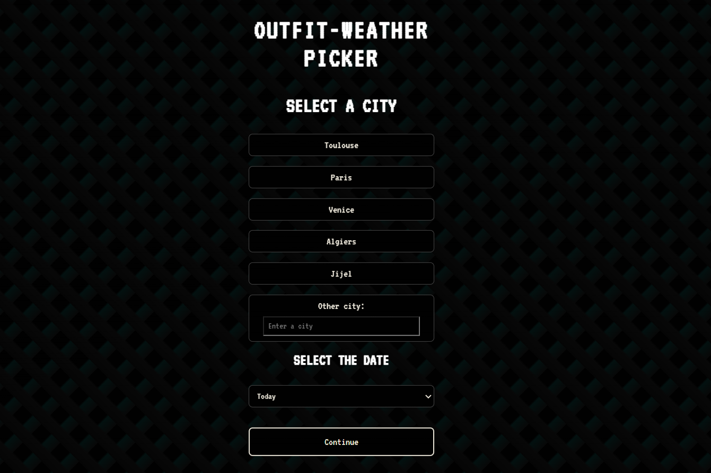
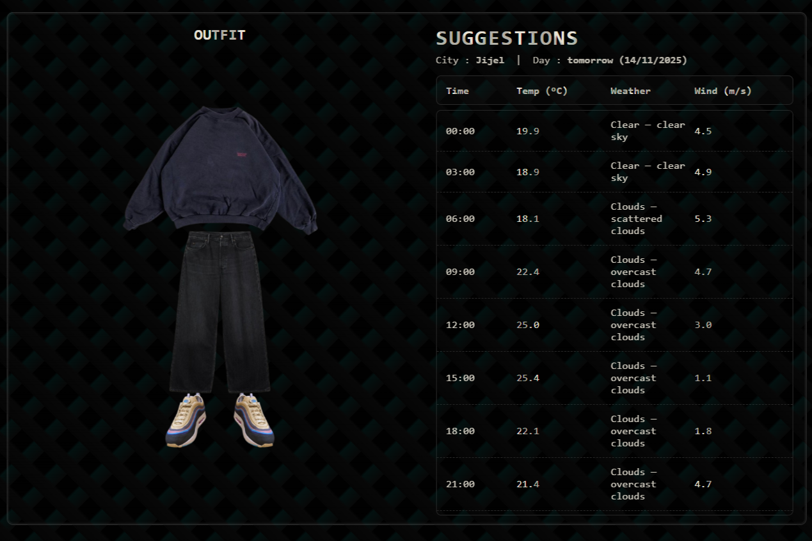

# Weather Outfit Suggestor

## Overview

This project presents a web app that suggests outfits based on the weather conditions of a given city, for a specific day (today, tomorrow, or after). 
It fetches real-time weather data and dynamically displays an outfit. The user can interact with the outfit by clicking on different items (e.g., pull, pants, etc.) to change them.

### Example

**First Page**:

**Suggestion Page**: 

## Features

- **City and Date Selection**: The user can input a city and select a date to check the weather forecast for that specific day (today, tomorrow, or the day after).
- **Weather Retrieval**: The app queries a weather API (OpenWeather) to fetch data including temperature, rain, wind, and humidity.
- **Outfit Suggestions**: Based on the weather data, the app suggests an outfit from a selection of available clothing items (jacket, sweater, t-shirt, pants, shoes).
- **Results Display**: The user sees the complete outfit along with the corresponding images and a brief summary of the weather (e.g., cold, hot, rainy).

## Technologies Used

- **React**: For building the user interface.
- **React Router**: For managing city and day parameters via URL.
- **Flask**: For handling the backend and serving the weather data.
- **Weather API (OpenWeather)**: Fetches live weather data (e.g., temperature, conditions, wind speed, humidity).

## Future Improvements

- **Custom Clothing**: Initially, the app suggests predefined clothing items (images stored locally). Later, users will be able to upload their own photos of clothing and use them in the outfit generation process.
- **Data Storage**: Data related to imported clothing and generated outfits will be saved in a database. This will allow users to keep a history and retrieve previously created outfits.
- **User Authentication**: A simple user authentication system (username and password) will allow each user to log in, save their favorite outfits, and like the ones they prefer.

## Deployment

The app will be deployed to a cloud platform so users will be able to access the app from any device.

